# :clapper: CNNect


## 📚 목차
- [💬 서비스 소개](#intro)
- [🎯 기획 배경](#plans)
- [🙇 팀원 소개](#members)
- [💡 주요 기능](#features)
- [🔑 기술 소개](#technology)
- [🔨 개발 환경](#skills)
- [🚀 포팅 메뉴얼](#installation)
- [📂 폴더 구조](#folder)

<a name="intro"></a>
## 💬 서비스 소개

**사용자의 관심사와 테스트를 통한 영어 실력을 기반으로 CNN 뉴스를 추천해주고 학습을 지원합니다.**

1. 뉴스 속 문장의 발음을 듣고 쉐도잉하며 스피킹 실력 향상
2. 발음 점수 측정을 통해 영어 발음 개선
3. 뉴스 스크립트의 해석본를 제공하여 독해 역량 향상
4. 레벨에 맞는 영단어와 한글의미를 제공하여 단어 실력을 향상
5. 학습한 영상에 대한 단어 테스트를 통해 이해도 평가
6. 사용자 관심사와 실력에 맞는 학습 영상 추천
7. 학습 통계를 시각적으로 확인하며 성과 확인 및 동기부여
8. 커스텀 단어장 및 영상 학습 기록을 제공하여 진행 상태 파악
9. 최신 뉴스의 학습자료(영상과 스크립트)가 매일 업데이트되도록 자동화
10. CEFR 레벨시스템에 따른 어휘 빈도수와 평균 문장 길이에 따른 영상 난이도 판별

<a name="plans"></a>
## 🎯 기획 배경
- 영어 실력의 중요성은 현대사회에서 점점 더 부각
- 듣기, 말하기, 쓰기, 읽기를 한번에 해결
- 정확한 문법, 또렷한 발음, 일정한 속도
- 다양한 주제, 시사적 안목 확장

<a name="members"></a>
## 🙇 팀원 소개

|**최동헌 (팀장/FS)**|**김하은 (팀원/FS)**|**이민주 (팀원/FS)**|
|:---:|:---:|:---:|
|인프라, 학습 기록 구현|인프라, 레벨 시스템|검색 기능, 회원 관리|

|**이은지 (팀원/FS)**|**유혜승 (팀원/FS)**|**차다운 (팀원/FS)**|
|:---:|:---:|:---:|
|학습 진행 관련 기능|데이터 수집 및 관리|뉴스 추천 알고리즘|

<a name="features"></a>

## 💡 주요 기능

### 🙋‍♀️ 로그인 및 회원가입

|  정보입력  |
|:---------:|
| 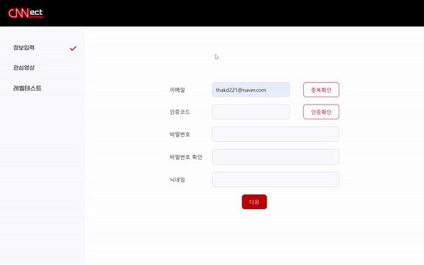 |

|  관심영상  |
|:---------:|
| 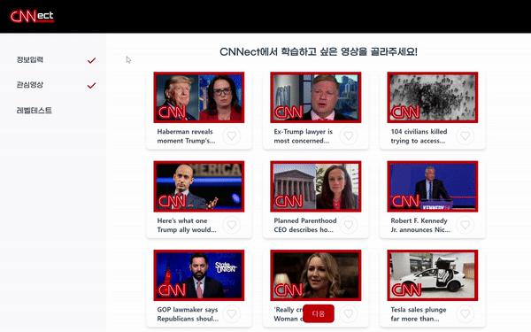 |

|  레벨테스트  |
|:---------:|
| 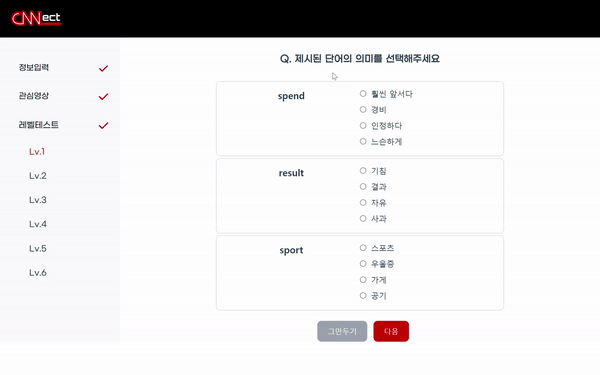 |

### 🎞 메인 페이지
|  최근 학습 뉴스와 추천 뉴스 |
|:---------:|
| 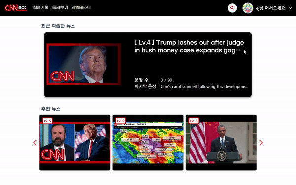 |


### 📑 영상 목록 페이지
|  카테고리별 조회  |
|:---------:|
| 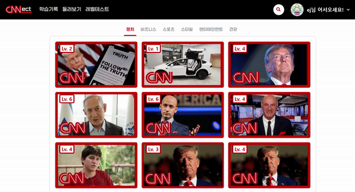 |

|  제목과 문장에서 키워드로 검색 |
|:---------:|
| 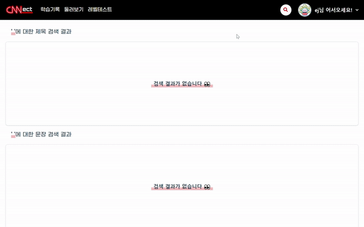 |


### ✏ 학습 진행 페이지 
|  스크립트  |
|:----------|
| 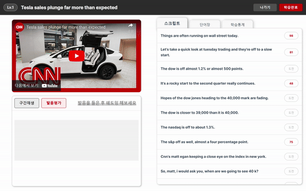 |

|   발음평가  |
|:----------:|
| 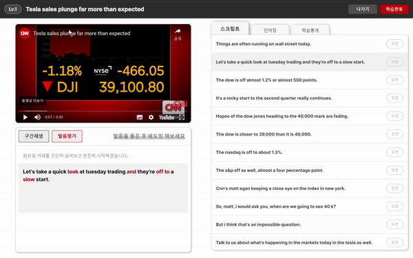 |

|  영어사전 팝업창  |
|:----------|
| 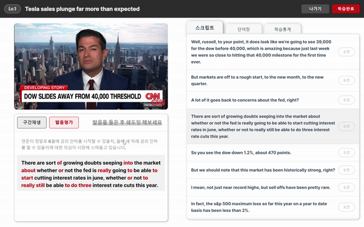 |

|  단어장  |
|:----------|
| 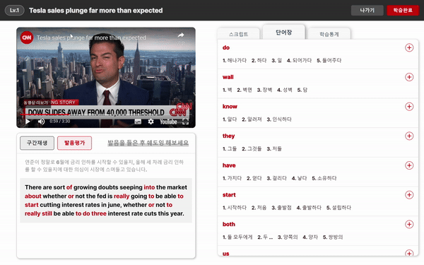 |

|  학습통계  |
|:----------|
| 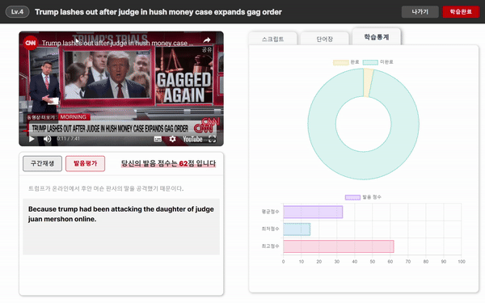 |

### 💯 학습 테스트 페이지
| 시험 문제 |
|:---------:|
| 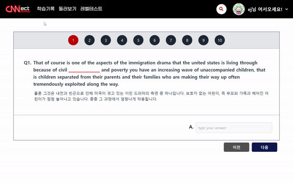 |

| 채점 결과 |
|:---------:|
| 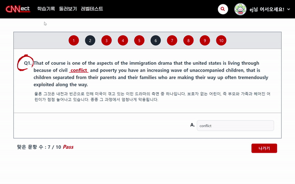 |

### 📑 학습 기록 페이지
|  학습 상태별 영상 |
|:---------:|
| 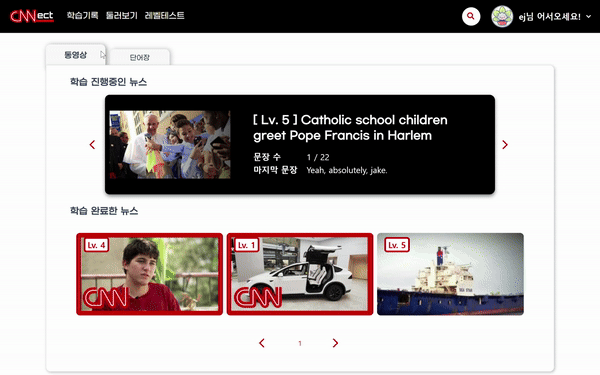 |

|  커스텀 단어장  |
|:---------:|
| 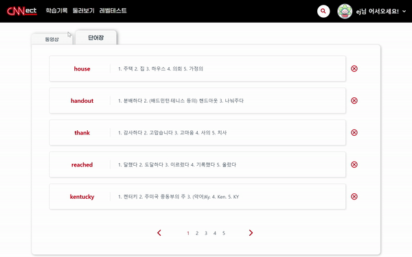 |

<a name="technology"></a>
## 🔑 기술 소개

### 📈 데이터 수집
- **scrapetube**를 사용하여 **16만개**의 CNN 유튜브 영상 크롤링
- **selenium**, **apscheduler**를 통해 새로 올라온 CNN 유튜브 영상을 하루 단위로 **자동 크롤링**

---

### 📉 데이터 전처리
- 스크립트 없는 데이터 제거
- **nltk.sent_tokenize**를 통해 발화 단위의 스크립트 타임라인을 **문장 단위**로 변경

---

### 📊 카테고리 모델링

_CNN 홈페지의 카테고리 기반 카테고라이징 모델_

➡ CNN 홈페이지에서 제공하는 기사 양이 한정적 + 카테고리 별 편차

➡ **데이터 증강**을 통해 기사 양 늘리고 편차 극복

➡ 임베딩을 통해 단어를 밀집 벡터로 매핑

➡ **평균 풀링**을 통해 고정 크기의 벡터 생성, 완전 연결 레이어를 통해 분류 수행

_**→ 모델 정확도 약 90%**_ 

---

### 🥇 난이도 선정

_아래의 두가지 지표를 혼합하여 난이도 선정_

| 단어 난이도 | 영상 난이도 |
|:-------|:-------|
| **CEFR** 유럽연합 공통언어 표준등급 | **Flesh-Reading Ease Score** |
| A1 - A2 - B1 - B2 - C1 - C2 | **범위** 0~100 <br/> **계산식** 206.835 - 1.015* (문장당 평균 단어 길이) - 84.6 * (평균 단어 수) |   

---
### ❤ 추천 알고리즘
_학습한 뉴스들과의 유사도를 토대로 뉴스 추천_
| TF-IDF 벡터화 & 코사인 유사도 | 추천 알고리즘 |
|:-------|:-------|
| 🤍 **TF (단어 빈도)** <br/> 특정 단어가 문서 내에 얼마나 자주 등장하는지 나타내는 값 <br/> 🤍 **DF (문서 빈도)** <br/> 다른 문서에서 특정 단어가 얼마나 자주 등장하는지 나타내는 값, 특정 단어를 가진 문서의 수 <br/> 🤍 **코사인 유사도** <br/> 두 벡터값 사이 코사인 각도| 🤍 사용자의 **레벨**과 동일한 레벨을 가지는 비디오를 **필터링** <br/> 🤍 학습기록의 각 뉴스와 전체뉴스와의 **유사도 측정** <br/> 🤍  **높은 유사도**를 가지는 뉴스 9개를 추출 <br/> 🤍  학습기록이나 레벨이 업데이트되면 추천 뉴스도 **업데이트** |

---
### 🔍 검색 기능
_ElasticSearch를 활용하여 검색 기능 최적화_
- **제목** 기준 검색, **스크립트** 기준 검색 기능 제공
- Monstache를 사용하여 Video 데이터가 저장된 MongoDB와 **실시간** 연동
- **역색인**(Inverted Index)을 통한 문자열 검색 속도 최적화
---


<a name="skills"></a>
## 🔨 개발 환경

#### Frontend
 


#### Backend
 


#### Infra
 


#### IDE
 

#### Version control
 

#### Management Tools
 


<a name="installation"></a>
## 🚀 포팅 메뉴얼
[포팅 메뉴얼](https://lab.ssafy.com/s10-bigdata-recom-sub2/S10P22A507/-/blob/master/exec/CNNect_A507_%ED%8F%AC%ED%8C%85%EB%A9%94%EB%89%B4%EC%96%BC.pdf?ref_type=heads)

<a name="folder"></a>
## 📂 폴더 구조
<details>
<summary>FE 폴더 구조</summary>
<div markdown="1">

```
📦frontend
 ┣ 📂.vscode
 ┣ 📂node_modules
 ┣ 📂public
 ┃ ┣ 📂badge
 ┃ ┣ 📂level
 ┣ 📂src
 ┃ ┣ 📂api
 ┃ ┃ ┣ 📜badge.js
 ┃ ┃ ┣ 📜eventBus.js
 ┃ ┃ ┣ 📜history.js
 ┃ ┃ ┣ 📜http.js
 ┃ ┃ ┣ 📜recommendations.js
 ┃ ┃ ┣ 📜scraping.js
 ┃ ┃ ┣ 📜search.js
 ┃ ┃ ┣ 📜sentence.js
 ┃ ┃ ┣ 📜study.js
 ┃ ┃ ┣ 📜test.js
 ┃ ┃ ┣ 📜user.js
 ┃ ┃ ┣ 📜video.js
 ┃ ┃ ┣ 📜voca.js
 ┃ ┃ ┗ 📜youtubeSetup.js
 ┃ ┣ 📂assets
 ┃ ┃ ┣ 📂gifs
 ┃ ┣ 📂components
 ┃ ┃ ┣ 📂common
 ┃ ┃ ┃ ┣ 📜CategoryVideoList.vue
 ┃ ┃ ┃ ┣ 📜DefaultHome.vue
 ┃ ┃ ┃ ┣ 📜Header.vue
 ┃ ┃ ┃ ┣ 📜NonLoginHome.vue
 ┃ ┃ ┃ ┗ 📜RecommVideoList.vue
 ┃ ┃ ┣ 📂history
 ┃ ┃ ┃ ┣ 📜CompletedVideo.vue
 ┃ ┃ ┃ ┣ 📜LearningVideo.vue
 ┃ ┃ ┃ ┗ 📜Voca.vue
 ┃ ┃ ┣ 📂study
 ┃ ┃ ┃ ┣ 📜PopupDictionary.vue
 ┃ ┃ ┃ ┣ 📜Quiz.vue
 ┃ ┃ ┃ ┣ 📜QuizResult.vue
 ┃ ┃ ┃ ┣ 📜Script.vue
 ┃ ┃ ┃ ┣ 📜Shadowing.vue
 ┃ ┃ ┃ ┣ 📜Title.vue
 ┃ ┃ ┃ ┣ 📜VideoPlayer.vue
 ┃ ┃ ┃ ┗ 📜Voca.vue
 ┃ ┃ ┗ 📂user
 ┃ ┃ ┃ ┣ 📜RegisterInfoComponent.vue
 ┃ ┃ ┃ ┣ 📜RegisterLevelComponent.vue
 ┃ ┃ ┃ ┣ 📜RegisterLevelDetailComponent.vue
 ┃ ┃ ┃ ┣ 📜RegisterLevelResultComponent.vue
 ┃ ┃ ┃ ┗ 📜RegisterVideoComponent.vue
 ┃ ┣ 📂router
 ┃ ┃ ┗ 📜index.js
 ┃ ┣ 📂stores
 ┃ ┃ ┗ 📜userStore.js
 ┃ ┣ 📂views
 ┃ ┃ ┣ 📂common
 ┃ ┃ ┃ ┣ 📜HomeView.vue
 ┃ ┃ ┃ ┣ 📜SearchView.vue
 ┃ ┃ ┃ ┗ 📜VideoView.vue
 ┃ ┃ ┣ 📂history
 ┃ ┃ ┃ ┗ 📜HistoryView.vue
 ┃ ┃ ┣ 📂level
 ┃ ┃ ┃ ┗ 📜LevelView.vue
 ┃ ┃ ┣ 📂study
 ┃ ┃ ┃ ┣ 📜QuizView.vue
 ┃ ┃ ┃ ┗ 📜StudyView.vue
 ┃ ┃ ┗ 📂user
 ┃ ┃ ┃ ┣ 📜MyPageView.vue
 ┃ ┃ ┃ ┗ 📜RegisterView.vue
 ┃ ┣ 📜App.vue
 ┃ ┣ 📜config.ini
 ┃ ┣ 📜index.css
 ┃ ┗ 📜main.js
 ```
</div>
</details>

<details>
<summary>BE 폴더 구조</summary>
<div markdown="1">

```
📦backend
 ┣ 📂gradle
 ┃ ┗ 📂wrapper
 ┣ 📂src
 ┃ ┣ 📂main
 ┃ ┃ ┣ 📂java
 ┃ ┃ ┃ ┗ 📂com
 ┃ ┃ ┃ ┃ ┗ 📂ssafy
 ┃ ┃ ┃ ┃ ┃ ┗ 📂cnnect
 ┃ ┃ ┃ ┃ ┃ ┃ ┣ 📂badge
 ┃ ┃ ┃ ┃ ┃ ┃ ┃ ┣ 📂controller
 ┃ ┃ ┃ ┃ ┃ ┃ ┃ ┣ 📂dto
 ┃ ┃ ┃ ┃ ┃ ┃ ┃ ┣ 📂entity
 ┃ ┃ ┃ ┃ ┃ ┃ ┃ ┣ 📂repository
 ┃ ┃ ┃ ┃ ┃ ┃ ┃ ┗ 📂service
 ┃ ┃ ┃ ┃ ┃ ┃ ┣ 📂config
 ┃ ┃ ┃ ┃ ┃ ┃ ┣ 📂exception
 ┃ ┃ ┃ ┃ ┃ ┃ ┃ ┣ 📂code
 ┃ ┃ ┃ ┃ ┃ ┃ ┃ ┣ 📂dto
 ┃ ┃ ┃ ┃ ┃ ┃ ┃ ┣ 📜GlobalException.java
 ┃ ┃ ┃ ┃ ┃ ┃ ┃ ┗ 📜UnAuthorizedException.java
 ┃ ┃ ┃ ┃ ┃ ┃ ┣ 📂oauth
 ┃ ┃ ┃ ┃ ┃ ┃ ┃ ┣ 📂controller
 ┃ ┃ ┃ ┃ ┃ ┃ ┃ ┣ 📂jwt
 ┃ ┃ ┃ ┃ ┃ ┃ ┃ ┃ ┣ 📂filter
 ┃ ┃ ┃ ┃ ┃ ┃ ┃ ┣ 📂repository
 ┃ ┃ ┃ ┃ ┃ ┃ ┃ ┣ 📂service
 ┃ ┃ ┃ ┃ ┃ ┃ ┃ ┗ 📂token
 ┃ ┃ ┃ ┃ ┃ ┃ ┣ 📂recommendation
 ┃ ┃ ┃ ┃ ┃ ┃ ┃ ┣ 📂controller
 ┃ ┃ ┃ ┃ ┃ ┃ ┃ ┣ 📂dto
 ┃ ┃ ┃ ┃ ┃ ┃ ┃ ┣ 📂entity
 ┃ ┃ ┃ ┃ ┃ ┃ ┃ ┣ 📂repository
 ┃ ┃ ┃ ┃ ┃ ┃ ┃ ┗ 📂service
 ┃ ┃ ┃ ┃ ┃ ┃ ┣ 📂result
 ┃ ┃ ┃ ┃ ┃ ┃ ┣ 📂search
 ┃ ┃ ┃ ┃ ┃ ┃ ┃ ┣ 📂controller
 ┃ ┃ ┃ ┃ ┃ ┃ ┃ ┣ 📂dto
 ┃ ┃ ┃ ┃ ┃ ┃ ┃ ┣ 📂entity
 ┃ ┃ ┃ ┃ ┃ ┃ ┃ ┣ 📂repository
 ┃ ┃ ┃ ┃ ┃ ┃ ┃ ┗ 📂service
 ┃ ┃ ┃ ┃ ┃ ┃ ┣ 📂user
 ┃ ┃ ┃ ┃ ┃ ┃ ┃ ┣ 📂controller
 ┃ ┃ ┃ ┃ ┃ ┃ ┃ ┣ 📂dto
 ┃ ┃ ┃ ┃ ┃ ┃ ┃ ┣ 📂entity
 ┃ ┃ ┃ ┃ ┃ ┃ ┃ ┣ 📂repository
 ┃ ┃ ┃ ┃ ┃ ┃ ┃ ┗ 📂service
 ┃ ┃ ┃ ┃ ┃ ┃ ┣ 📂userHistory
 ┃ ┃ ┃ ┃ ┃ ┃ ┃ ┣ 📂controller
 ┃ ┃ ┃ ┃ ┃ ┃ ┃ ┣ 📂dto
 ┃ ┃ ┃ ┃ ┃ ┃ ┃ ┣ 📂entity
 ┃ ┃ ┃ ┃ ┃ ┃ ┃ ┣ 📂repository
 ┃ ┃ ┃ ┃ ┃ ┃ ┃ ┗ 📂service
 ┃ ┃ ┃ ┃ ┃ ┃ ┣ 📂userSentence
 ┃ ┃ ┃ ┃ ┃ ┃ ┃ ┣ 📂controller
 ┃ ┃ ┃ ┃ ┃ ┃ ┃ ┣ 📂dto
 ┃ ┃ ┃ ┃ ┃ ┃ ┃ ┣ 📂entity
 ┃ ┃ ┃ ┃ ┃ ┃ ┃ ┣ 📂repository
 ┃ ┃ ┃ ┃ ┃ ┃ ┃ ┗ 📂service
 ┃ ┃ ┃ ┃ ┃ ┃ ┣ 📂video
 ┃ ┃ ┃ ┃ ┃ ┃ ┃ ┣ 📂controller
 ┃ ┃ ┃ ┃ ┃ ┃ ┃ ┣ 📂dto
 ┃ ┃ ┃ ┃ ┃ ┃ ┃ ┣ 📂entity
 ┃ ┃ ┃ ┃ ┃ ┃ ┃ ┣ 📂repository
 ┃ ┃ ┃ ┃ ┃ ┃ ┃ ┗ 📂service
 ┃ ┃ ┃ ┃ ┃ ┃ ┣ 📂voca
 ┃ ┃ ┃ ┃ ┃ ┃ ┃ ┣ 📂controller
 ┃ ┃ ┃ ┃ ┃ ┃ ┃ ┣ 📂dto
 ┃ ┃ ┃ ┃ ┃ ┃ ┃ ┣ 📂entity
 ┃ ┃ ┃ ┃ ┃ ┃ ┃ ┣ 📂repository
 ┃ ┃ ┃ ┃ ┃ ┃ ┃ ┗ 📂service
 ┃ ┃ ┃ ┃ ┃ ┃ ┗ 📜CnnectApplication.java
 ┃ ┃ ┗ 📂resources
 ┃ ┃ ┃ ┗ 📜application.properties
```
</div>
</details>

<details>
<summary>DATA 폴더 구조</summary>
<div markdown="1">

```
📦data
 ┣ 📂conf
 ┣ 📂data
 ┃ ┣ 📂csv
 ┃ ┃ ┗ 📜result.csv
 ┃ ┣ 📂ipynb
 ┃ ┃ ┣ 📜categorize.ipynb
 ┃ ┃ ┣ 📜level_video.ipynb
 ┃ ┃ ┗ 📜word_video.ipynb
 ┃ ┣ 📂json
 ┃ ┃ ┣ 📜addCategory.json
 ┃ ┃ ┣ 📜addDifficulty.json
 ┃ ┃ ┣ 📜cnnect_baseData.json
 ┃ ┃ ┗ 📜cnnect_final.json
 ┃ ┗ 📂py
 ┃ ┃ ┣ 📜category_model.h5
 ┃ ┃ ┣ 📜config_reader.py
 ┃ ┃ ┣ 📜crawling.py
 ┃ ┃ ┣ 📜sample.json
 ┃ ┃ ┣ 📜script_category.py
 ┃ ┃ ┣ 📜script_info.py
 ┃ ┃ ┣ 📜script_level.py
 ┃ ┃ ┗ 📜videoId.py
 ┣ 📂recommendation
 ┃ ┣ 📜config_reader.py
 ┃ ┣ 📜recommendedNewsByScript.py
 ┣ 📂test
 ┃ ┣ 📜leveltest.py
 ┃ ┣ 📜videotest.py
 ┣ 📜app.py
 ┣ 📜Dockerfile
 ┗ 📜requirements.txt 
```
</div>
</details>
